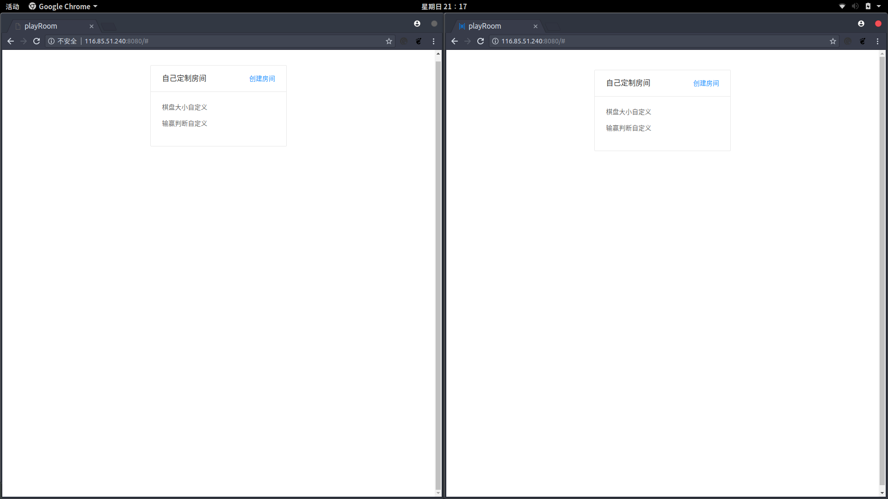
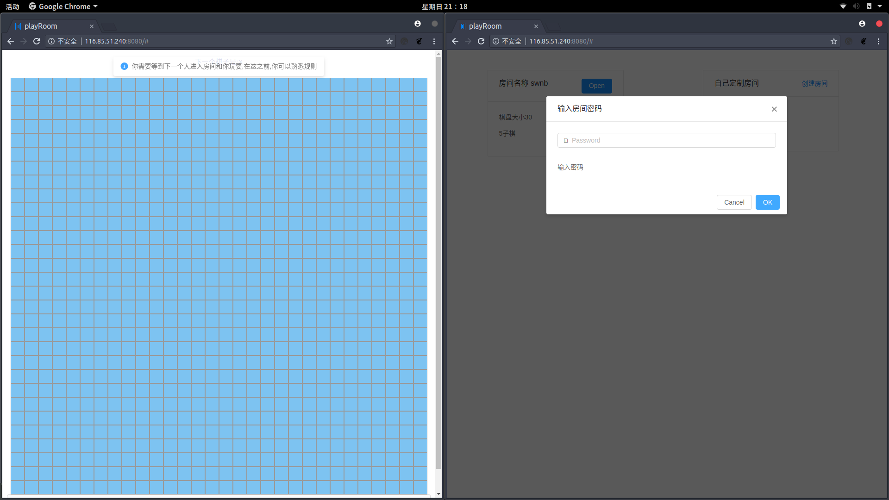

# react-project
this is  a personal project for react

第二天的代码完成了
* 自定义棋盘大小
* 自定义输赢的数目
* 棋盘历史
* 棋盘sort函数bug修复
* 棋盘引入redux来处理信息

主要对于react的棋盘教程的案例进行扩展，可以自定义棋盘大小，自定义胜利的棋子数目,还有判断输赢的算法做了优化。
现在的暂时的效果在[这里](https://swnb.github.io/react-project/views/second.html),欢迎大家帮我测试一下...后面放入服务器,加点颜色,加入websocket,做成可以定制的游戏,代码日后可以开个专题来说.

这个项目主要对于`react`的棋盘教程的案例进行扩展，可以自定义你的棋盘大小，还有判断输赢的算法做了优化。

**目前的**效果图






第三天代做的事情
* 将它改造成为`websocket`
* 添加颜色,优化代码,历史记录用红线连接起来..
* ~~重构代码,逻辑组件和ui组件分离~~ (完成) 

最后两天的开发工作也差不多完成了,因为本人没有服务器,就不提供测试地址了

完成的功能
* 通过socket.io,成功将项目改成了`websocket`
* 创建房间房间,生成游戏房间
* 自定义规则和期盼大小
* 进入房间计算输赢次数
* 根据每次结果生成历史记录
* 毁灭房间功能
* 房间`namespace`加密

你只需要
```
git clone https://github.com/swnb/react-project.git

cd react-project

yarn 

webpack 

node index.js
```


就可以成功在[8080端口](http://localhost:8080)查看..之后创建房间,让你的兄弟进入房间,你们开始比赛...

后面加入`ui美化`,开心...

我之后会开一个专题谈谈这个项目的心得

`gh-page`的测试的[地址在这里](https://swnb.github.io/react-project/views/second.html)


附带一个自己写的webpack学习的插件，有兴趣，可以在[这里看](https://github.com/swnb/webpack-plugin)，主要实现html-webpack-plugin的一些简答功能，比如模板等。