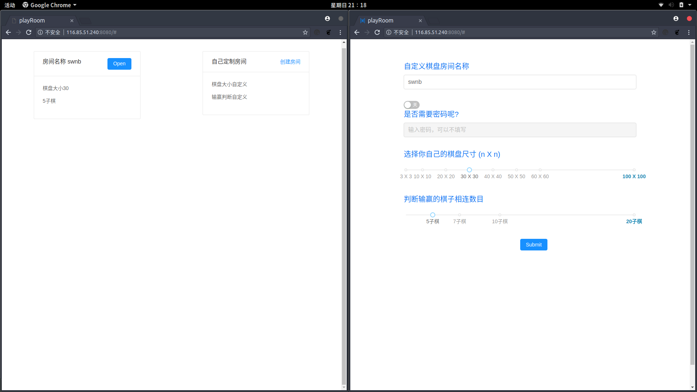
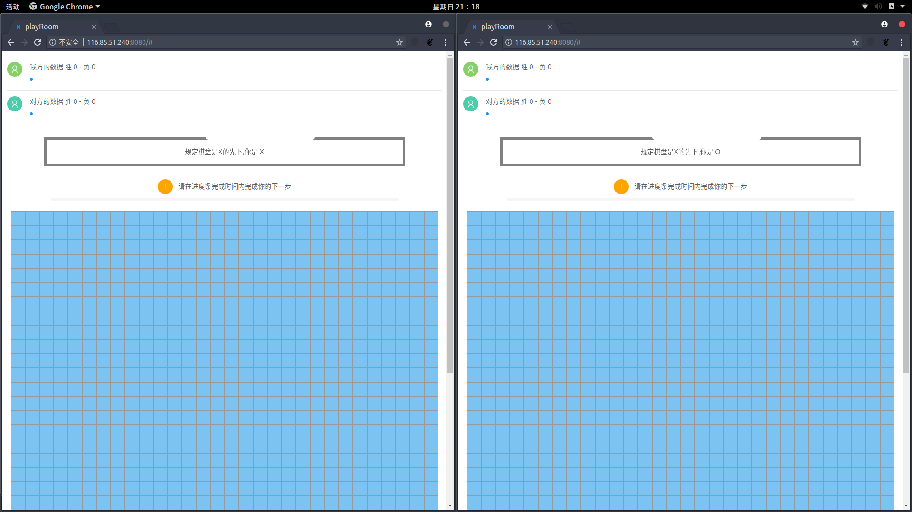

# chess

一个在线对弈的棋盘类单页面应用.

技术栈 => `react`+`antd`+`node`+`socket.io`+`golang`

[服务器链接](http://116.85.51.240:8080/) (要两个人才能玩)
>js的代码在打包混淆压缩后还有1M多(一开始没想到),加上服务器带宽一般,所以要加载久一点,已经设置额缓存,请谅解..

***
完成的功能
- [x] 创建房间 --完成
- [x] 登录房间 --完成
- [x] 自定义房间大小和输赢规则

***
开发

**注意 该项目基于`linux`开发,虽然`node`跨平台,但是`golang`只编译了`linux`平台的,所以需要在`linux`系统上才能正常运行**

首先你需要有`node 6`的版本来支持`es6/7`的新特性,其次,你需要安装[yarn](https://yarnpkg.com/en/docs/install)

下载项目
```shell
    git clone https://github.com/swnb/chess.git
```

下载依赖
```shell
    cd chess

    yarn 
```

打包前端代码
```shell
    yarn run build
```

运行服务

```shell
    yarn run server
```

登录本地`8080`端口查看 => [这里](http://localhost:8080/)


***
示例






